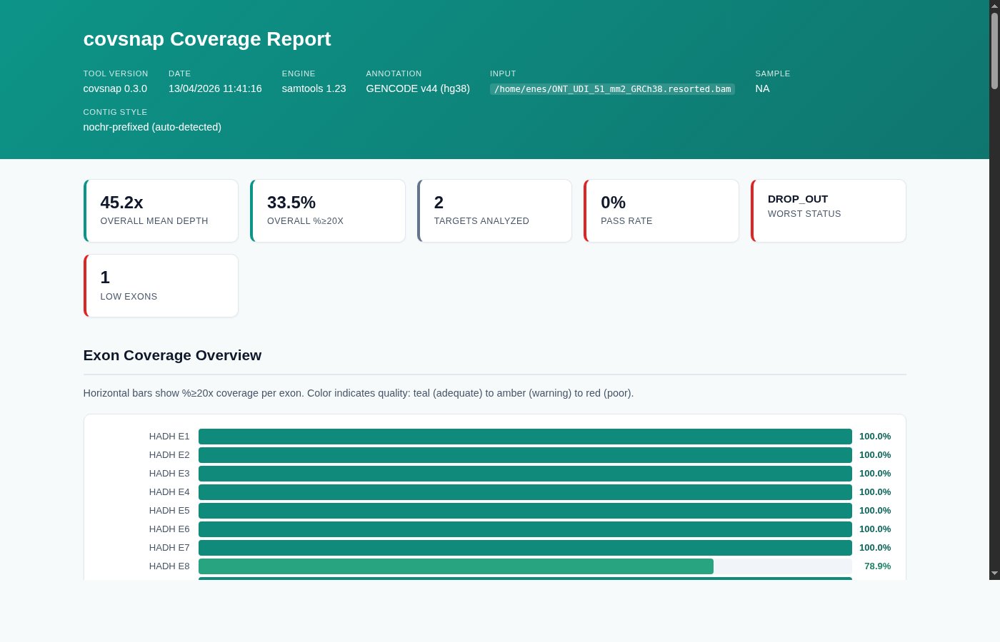
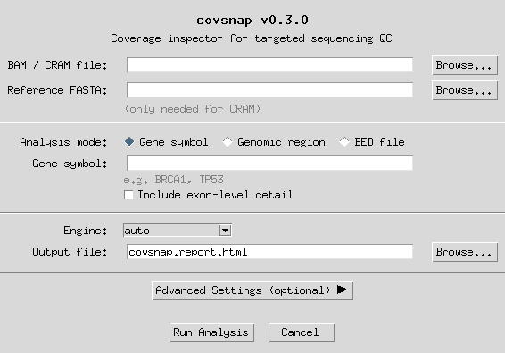

<p align="center">
  
</p>

<h1 align="center">covsnap</h1>

<p align="center">
  <strong>Coverage inspector for targeted sequencing QC (hg38)</strong>
</p>

<p align="center">
  <a href="https://anaconda.org/bioconda/covsnap"></a>
  <a href="https://pypi.org/project/covsnap/"></a>
  <a href="https://quay.io/repository/biocontainers/covsnap"></a>
  <a href="https://doi.org/10.5281/zenodo.18732742"></a>
  <a href="LICENSE"></a>
</p>

<p align="center">
  covsnap computes per-target and per-exon depth-of-coverage metrics from BAM/CRAM files aligned to <b>hg38</b>.<br>
  It produces a self-contained interactive HTML report with automated PASS/FAIL classification<br>
  — designed for clinical and research sequencing QC workflows.
</p>

---

## Demo

https://github.com/enes-ak/covsnap/releases/download/v0.3.0/covsnap-demo.mp4

## Screenshots

### Interactive HTML Report

<p align="center">
  
</p>

### Graphical Interface

<p align="center">
  
</p>

---

## Key Features

| | Feature | Description |
|---|---|---|
| **GUI** | Graphical interface | Run `covsnap` with no arguments to launch a Tkinter GUI. Works on Linux, macOS, and Windows. |
| **Genes** | Gene-aware analysis | Look up genes by symbol (`BRCA1`) or analyze multiple genes at once (`BRCA1,TP53,ETFDH`). Built-in dictionary of ~60 genes + optional full GENCODE v44 index (62,700+ genes). |
| **Exons** | Exon-level resolution | Per-exon depth metrics via `--exons` using MANE Select transcripts from GENCODE v44. |
| **Exon-only** | Intronic exclusion | `--exon-only` computes gene-level metrics from exonic regions only — ideal for targeted/exome panels where introns have no coverage by design. |
| **Region** | Region & BED modes | Accepts genomic coordinates (`chr17:43044295-43125482`) or a BED file. Region mode auto-discovers overlapping genes and exons. |
| **Report** | Interactive HTML report | Self-contained HTML with summary cards, exon bar charts, accordion details, glossary, and PASS/FAIL classifications. |
| **Engine** | Dual engine support | Prefers [mosdepth](https://github.com/brentp/mosdepth) when available; falls back to `samtools depth`. |
| **Perf** | Streaming architecture | O(1) memory per target using Welford's algorithm and histogram-based exact median. Parallel execution. |
| **Smart** | Auto-detection | Contig style auto-detection (chr/no-chr), gene alias resolution (`HER2` -> `ERBB2`), fuzzy suggestions for typos. |
| **Safety** | BED guardrails | Configurable limits on target count, total bases, and file size to prevent accidental WES/WGS runs. |

---

## Installation

### From Bioconda (recommended)

```bash
conda install -c bioconda covsnap
```

### From PyPI

```bash
pip install covsnap
```

### Docker (BioContainers)

```bash
docker pull quay.io/biocontainers/covsnap:0.3.0--pyhdfd78af_0
docker run --rm -v $(pwd):/data quay.io/biocontainers/covsnap:0.3.0--pyhdfd78af_0 \
    covsnap /data/sample.bam BRCA1 -o /data/report.html
```

### From source

```bash
git clone https://github.com/enes-ak/covsnap.git
cd covsnap
pip install .
```

### Runtime requirements

| Dependency | Version | Required? |
|---|---|---|
| Python | >= 3.9 | Yes |
| pysam | >= 0.22 | Yes |
| numpy | >= 1.24 | Yes |
| samtools | any recent | Yes (engine) |
| mosdepth | >= 0.3 | Optional (preferred engine) |

> At least one of `samtools` or `mosdepth` must be on your `$PATH`. When `--engine auto` (the default), covsnap prefers mosdepth and falls back to samtools.

---

## Quick Start

### Graphical interface

```bash
covsnap
```

Run with no arguments to launch the GUI — select your BAM file, choose analysis mode, configure options, and run.

### Gene mode

```bash
covsnap sample.bam BRCA1
```

Produces `covsnap.report.html` with coverage metrics and PASS/FAIL classification.

### Multiple genes with exon breakdown

```bash
covsnap sample.bam BRCA1,TP53,ETFDH --exons
```

### Exon-only mode (exclude introns)

For targeted/exome panels where intronic regions have no coverage by design:

```bash
covsnap sample.bam BRCA1 --exon-only           # gene metrics from exons only
covsnap sample.bam BRCA1 --exon-only --exons   # same + show exon details in report
```

`--exon-only` and `--exons` are independent flags:

| `--exons` | `--exon-only` | Gene metrics based on | Exon details in report |
|:---------:|:-------------:|---|---|
| | | full gene (introns + exons) | no |
| x | | full gene (introns + exons) | yes |
| | x | exonic regions only | no |
| x | x | exonic regions only | yes |

### Region mode

```bash
covsnap sample.bam chr17:43044295-43125482
```

Overlapping genes and exons are auto-discovered.

### BED mode

```bash
covsnap sample.bam --bed targets.bed
```

### CRAM files

```bash
covsnap sample.cram BRCA1 --reference hg38.fa
```

---

## HTML Report

covsnap produces a single self-contained HTML file (no external dependencies) containing:

- **Summary cards** — key metrics at a glance (mean depth, coverage breadth, classification)
- **Exon bar chart** — per-exon coverage with smooth HSL color gradient (red -> amber -> teal)
- **Accordion details** — expandable per-target and per-exon metrics
- **Low-coverage blocks** — contiguous regions below threshold (when `--emit-lowcov` is used)
- **Classification heuristics reference** — applied rules and thresholds
- **Glossary** — definitions of all metrics and classification terms

---

## Classification Heuristics

Each target is classified using ordered heuristics (first match wins):

| Status | Condition |
|---|---|
| **DROP_OUT** | `pct_zero > 5%` OR any zero-coverage block >= 500 bp |
| **UNEVEN** | `mean_depth > 20` AND coefficient of variation > 1.0 |
| **LOW_EXON** | Any exon with `pct_ge_20 < 90%` or `pct_zero > 5%` (exon mode only) |
| **LOW_COVERAGE** | `pct_ge_20 < 95%` |
| **PASS** | `pct_ge_20 >= 95%` AND `pct_zero <= 1%` |

All thresholds are tunable via CLI flags:

```bash
covsnap sample.bam BRCA1 \
    --pass-pct-ge-20 98.0 \
    --pass-max-pct-zero 0.5 \
    --dropout-pct-zero 3.0 \
    --uneven-cv 0.8
```

---

## BED Guardrails

When using `--bed`, covsnap enforces limits to prevent accidental whole-exome/whole-genome processing:

| Parameter | Default | Flag |
|---|---|---|
| Max target intervals | 2,000 | `--max-targets` |
| Max total base pairs | 50 Mb | `--max-total-bp` |
| Max BED file size | 50 MB | `--max-bed-bytes` |

When limits are exceeded, the behavior is controlled by `--on-large-bed`:

| Mode | Behavior |
|---|---|
| `error` | Exit with code 4 |
| `warn_and_clip` (default) | Keep the first N targets that fit within limits |
| `warn_and_sample` | Reservoir sample N targets (deterministic with `--large-bed-seed`) |

---

## Building the Full Gene Index

The package ships with a built-in dictionary of ~60 clinically relevant genes. For access to the full GENCODE v44 catalog (62,700+ genes, 201,000+ MANE Select exons), build the tabix index:

```bash
# Download GENCODE v44 GTF (~1.5 GB)
wget https://ftp.ebi.ac.uk/pub/databases/gencode/Gencode_human/release_44/gencode.v44.annotation.gtf.gz

# Build the index
python scripts/build_gene_index.py gencode.v44.annotation.gtf.gz

# Reinstall to include index files
pip install .
```

This creates `hg38_genes.tsv.gz`, `hg38_exons.bed.gz`, and `hg38_gene_aliases.json.gz` in `src/covsnap/data/`.

---

## Full CLI Reference

```
covsnap [-h] [--version] [--bed BED] [--exons] [--exon-only]
        [--reference FASTA] [--no-index]
        [--engine {auto,mosdepth,samtools}] [--threads N]
        [-o FILE] [--emit-lowcov] [--lowcov-threshold N] [--lowcov-min-len N]
        [--max-targets N] [--max-total-bp N] [--max-bed-bytes BYTES]
        [--on-large-bed {error,warn_and_clip,warn_and_sample}]
        [--large-bed-seed N] [--pct-thresholds LIST]
        [--pass-pct-ge-20 F] [--pass-max-pct-zero F]
        [--dropout-pct-zero F] [--uneven-cv F]
        [--exon-pct-ge-20 F] [--exon-max-pct-zero F]
        [-v] [--quiet]
        alignment [target]
```

### Positional arguments

| Argument | Description |
|---|---|
| `alignment` | Path to BAM or CRAM file |
| `target` | Gene symbol, comma-separated gene list, or genomic region. Mutually exclusive with `--bed` |

### Commonly used options

| Flag | Description | Default |
|---|---|---|
| `--bed BED` | BED file of target intervals | -- |
| `--exons` | Show exon-level details in the report (gene mode only) | off |
| `--exon-only` | Compute gene metrics from exonic regions only, excluding introns | off |
| `--reference FASTA` | Reference FASTA for CRAM decoding | -- |
| `--engine` | Depth engine: `auto`, `mosdepth`, `samtools` | `auto` |
| `--threads N` | Parallel workers for samtools / threads for mosdepth | 4 |
| `-o FILE` / `--output FILE` | HTML report output path | `covsnap.report.html` |
| `--emit-lowcov` | Include low-coverage blocks in the report | off |
| `-v` / `--verbose` | Increase verbosity (repeatable) | -- |
| `--quiet` | Suppress non-error output | off |

---

## Exit Codes

| Code | Meaning |
|---|---|
| 0 | Success |
| 1 | Invalid arguments or input validation failure |
| 2 | Engine error (samtools/mosdepth failure) |
| 3 | Unknown gene name (with fuzzy suggestions printed to stderr) |
| 4 | BED guardrail limits exceeded (when `--on-large-bed error`) |
| 5 | CRAM reference not provided (missing `--reference` and no `REF_PATH`/`REF_CACHE`) |

---

## Running Tests

```bash
pip install ".[test]"
pytest
```

The test suite uses synthetic BAM files generated on the fly (no real sequencing data needed). Tests requiring the full GENCODE index or mosdepth are automatically skipped if unavailable.

---

## Project Structure

```
covsnap/
├── src/covsnap/
│   ├── __init__.py          # Version, build, annotation constants
│   ├── cli.py               # CLI entry point and orchestration
│   ├── annotation.py        # Gene lookup, contig detection, region parsing
│   ├── bed.py               # Streaming BED parser with guardrails
│   ├── metrics.py           # TargetAccumulator (Welford + histogram)
│   ├── engines.py           # samtools / mosdepth depth computation
│   ├── gui.py               # Tkinter graphical interface
│   ├── html_report.py       # Self-contained interactive HTML report
│   ├── report.py            # Classification heuristics
│   └── data/                # Gene/exon tabix indexes + logo (GENCODE v44)
├── tests/                   # Comprehensive test suite
├── scripts/
│   ├── build_gene_index.py  # GENCODE GTF -> tabix index builder
│   └── covsnap.desktop      # Linux desktop entry
├── recipes/conda/           # Bioconda-compatible recipe
└── pyproject.toml
```

---

## Coordinate Convention

All output coordinates use **0-based half-open** intervals, consistent with BED format. User-facing region input accepts **1-based inclusive** coordinates (e.g. `chr17:1000-1099`), which are internally converted.

---

## License

MIT License. See [LICENSE](LICENSE) for details.
